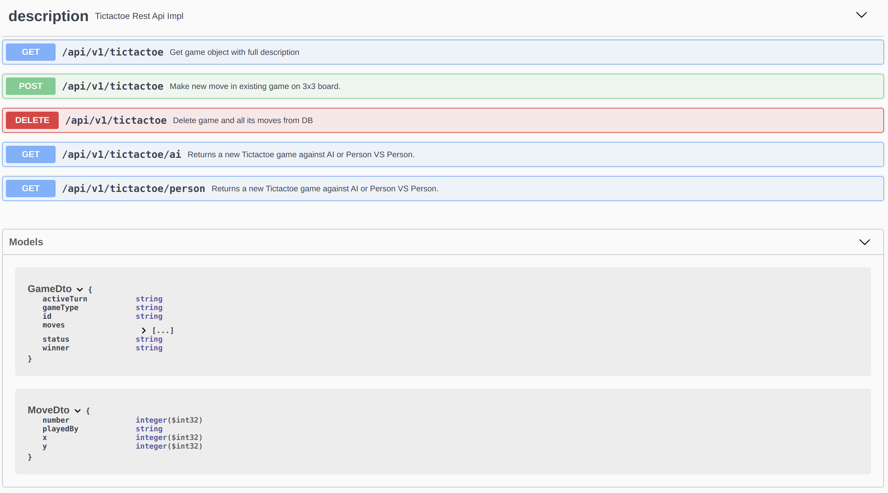
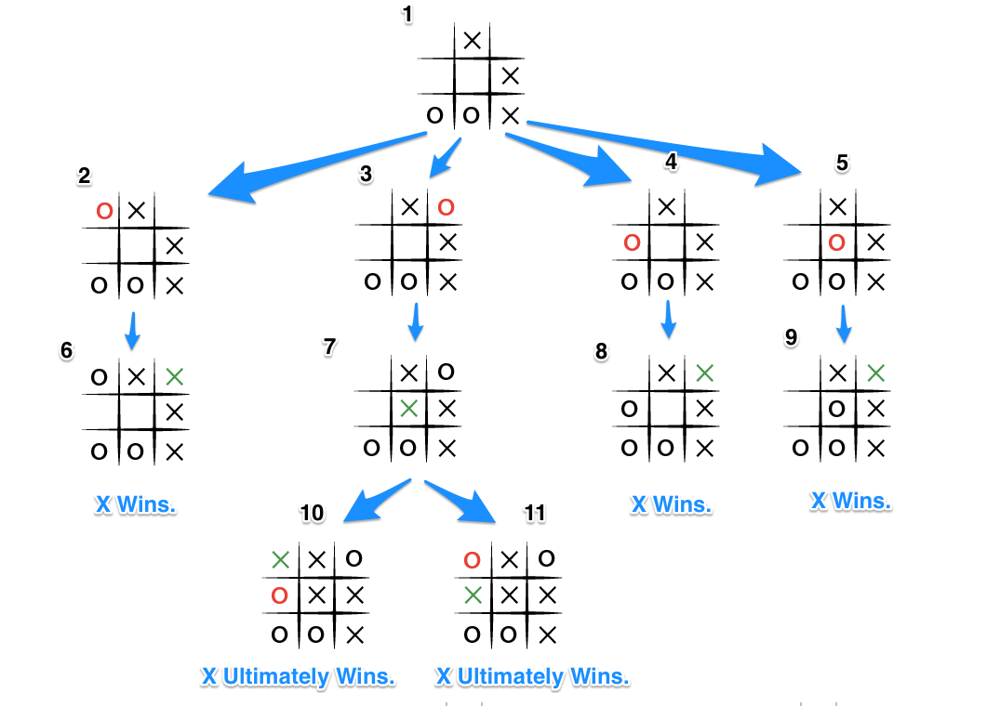
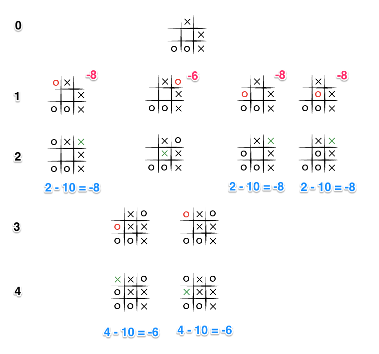

## Introduction

This project is the backend component with REST API of well known game Tic Tac Toe.

### Rules

1. There are 2 players
2. Every player is represented by a unique symbol, usually it's X and O
3. The board consists of a 3x3 matrix. A player wins if they can align 3 of their
   markers in a vertical, horizontal or diagonal line
4. If no more moves are possible, the game should finish

### Supported game modes
- Person vs Person
- Person vs AI
 
## Solution

Tictactoe microservice properties:
- stateless
- asynchronous
- horizontally scalable
- efficient
- [thread safe](https://www.baeldung.com/spring-webflux-concurrency)

Backend framework Spring Boot 2.7.5 using with reactive Webflux and 
reactive MongoDb for persistence.

## Build

```shell
mvn package -P docker
```

### Run locally

```shell
docker-compose up -d
```

### Test

Simple test suite consists of:
1. Unit tests 
2. REST API tests.
3. Engine performance tests

Test scenarios:
1. Game AI vs AI leads to draw
2. Lost game against AI
3. Draw game against AI
4. Person_1 vs Person_2 win, lost, draw

```shell
mvn test
[INFO] 
[INFO] Results:
[INFO] 
[INFO] Tests run: 18, Failures: 0, Errors: 0, Skipped: 0
[INFO] 
[INFO] ------------------------------------------------------------------------
[INFO] BUILD SUCCESS
[INFO] ------------------------------------------------------------------------
[INFO] Total time:  31.163 s
[INFO] Finished at: 2022-10-24T19:41:03+02:00
[INFO] ------------------------------------------------------------------------
```

## REST API Documentation

Detailed description of available endpoints is available

```
http://127.0.0.1:8080/swagger-ui/#/description
```



## Test Manually using Postman

There is a [Postman collection](tictactoe.postman_collection.json) available for convenience, but it's
possible to
use
CURL via command line to test if environment is up and running.

## Test Manually using CLI

There is CLI available in test package with very simple interface
```shell
Enter x y coordinates
1 1
| O |   |   |
|   | X |   |
|   |   |   |
Active turn PLAYER
Game IN_PROGRESS winner: NOT_DEFINED_YET
```
```java
package challenge.utils.Cli;
```
#### Response

```json
{
  "id": "6356ac3bdea5660cd0799a9f",
  "status": "CREATED",
  "winner": "NOT_DEFINED_YET",
  "activeTurn": "PLAYER",
  "gameType": "AGAINST_AI"
}
```

---

#### Request Person 1 vs Person 2 game

```shell
curl -X GET http://127.0.0.1:8080/api/v1/tictactoe/person
```

```json
{
  "id": "6356ac8bdea5660cd0799aa0",
  "status": "CREATED",
  "winner": "NOT_DEFINED_YET",
  "activeTurn": "PLAYER_1",
  "gameType": "AGAINST_HUMAN"
}
```
---

#### Request AI game

```shell
curl -X GET http://127.0.0.1:8080/api/v1/tictactoe/ai
```

```json
{
    "id": "6356d4419589c93abd0f9cd1",
    "status": "CREATED",
    "winner": "NOT_DEFINED_YET",
    "activeTurn": "PLAYER",
    "gameType": "AGAINST_AI"
}
```
### Make a move

Request

```shell
curl -X POST  http://127.0.0.1:8080/api/v1/tictactoe?gameId=6356d4419589c93abd0f9cd1 \
-H "Content-Type: application/json" \
--data '{"x": 1, "y": 1}
```

Response player vs ai

```json
{
  "id": "6356d4419589c93abd0f9cd1",
  "moves": [
    {
      "x": 1,
      "y": 1,
      "number": 1,
      "playedBy": "PLAYER"
    },
    {
      "x": 0,
      "y": 0,
      "number": 2,
      "playedBy": "AI"
    }
  ],
  "status": "IN_PROGRESS",
  "winner": "NOT_DEFINED_YET",
  "activeTurn": "PLAYER",
  "gameType": "AGAINST_AI"
}
```
Response player vs player
```json
{
    "id": "6356e47b4c46f96b890fd420",
    "moves": [
        {
            "x": 2,
            "y": 1,
            "number": 1,
            "playedBy": "PLAYER_1"
        },
        {
            "x": 1,
            "y": 1,
            "number": 2,
            "playedBy": "PLAYER_2"
        },
        {
            "x": 1,
            "y": 0,
            "number": 3,
            "playedBy": "PLAYER_1"
        },
        {
            "x": 1,
            "y": 2,
            "number": 4,
            "playedBy": "PLAYER_2"
        },
        {
            "x": 2,
            "y": 2,
            "number": 5,
            "playedBy": "PLAYER_1"
        },
        {
            "x": 0,
            "y": 1,
            "number": 6,
            "playedBy": "PLAYER_2"
        },
        {
            "x": 2,
            "y": 0,
            "number": 7,
            "playedBy": "PLAYER_1"
        }
    ],
    "status": "FINISHED",
    "winner": "PLAYER_1",
    "gameType": "AGAINST_HUMAN"
}
```

## AI Minimax algorithm

The essence of the Minimax algorithm is an alternate enumeration of the possible moves of two players, in which we believe that the player "whose turn" will choose the move that brings the maximum number of points. Suppose that we are playing for player "X", then the description of the algorithm will be something like this:

If the game is over, return the score for player "X"
Otherwise, get a list of new play area states for each possible move
Estimate the possible payoff for each possible state
For each of the possible states, add a "Minimax" estimate of the current state
If player's move is "X", return the move with the maximum score
If the player's move is "O", return the move with the minimum number of points

The algorithm is recursive using BFS, and the calculation is performed for each of the players in turn until the final 
payoff is calculated.



